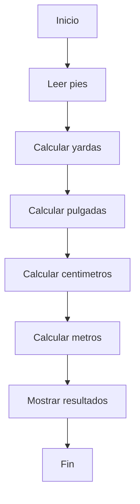

# Universidad Nacional De Loja
## Portafolio Digital de Aprendizaje – Teoría de la Programación.
- | **Estudiante** | Jose Camilo Merino Morocho |
- | **Institución** | Universidad Nacional De Loja |
- | **Carrera** | Ingenieria en Computacion |
- | **Asignatura** | Teoria De La Programacion |
- | **Ciclo** | Primero |
- | **Período Académico** | 2026 |
- | **Docente** | Ing. Lissette Lopez |

# 🚀 Unidad 1: Fundamentos de Programación
### 🔹 Conceptos clave

- **Algoritmo** → Secuencia de pasos para resolver un problema  
- **Pseudocódigo** → Algoritmo escrito de forma sencilla  
- **Diagrama de flujo** → Representación gráfica del proceso  
- **Prueba de escritorio** → Simulación manual del algoritmo  
- **Lenguajes de programación** → Ej: C, Python, Java  

---------------------------------------

### 🧩 Programación por bloques

> 💡 Permite programar de forma visual usando bloques (ej: Scratch), facilitando el aprendizaje de la lógica sin preocuparse por la sintaxis.

----------------------------------------

# 🛠️ Ejercicio con estructura secuencial: Conversión de Medidas


## 📌 Planteamiento del problema
- Escribir un programa para convertir una medida dada en pies a sus equivalentes en: a) yardas; b) pulgadas; c) centímetros; y d) metro. (1 pie: 12 pulgadas, 1 yarda= 3 pies, 1 pulgada= 2.54 cm, 1 metro= 100 cm). Leer el número de pies e imprimir el número de yardas, pies, pulgadas, centímetros y metros.


## 🔍 Análisis del problema

ENTRADA:
- pies

PROCESO:
- yardas = pies / 3
- pulgadas = pies * 12
- centimetros = pulgadas * 2.54
- metros = centimetros / 100

SALIDA:
- Conversión a todas las unidades

## ✍️ Diseño Del Algoritmo

### Psudocodigo
Inicio
   Leer pies
   yardas = pies / 3
   pulgadas = pies * 12
   centimetros = pulgadas * 2.54
   metros = centimetros / 100
   Escribir resultados
Fin

### Diagrama de Flujo


### Codigo en C
```c
#include <stdio.h>

int main(){
    float pies, yardas, pulgadas, centimetros, metros;

    printf("Ingrese su medida en pies: ");
    scanf("%f", &pies);

    yardas = pies / 3;
    pulgadas = pies * 12;
    centimetros = pulgadas * 2.54;
    metros = centimetros / 100;

    printf("La medida en pies es: %.2f\n", pies);
    printf("Su medida en yardas es: %.2f\n", yardas);
    printf("Su medida en pulgadas es: %.2f\n", pulgadas);
    printf("Su medida en centimetros es: %.2f\n", centimetros);
    printf("Su medida en metros es: %.2f\n", metros);

    return 0;
}
```


