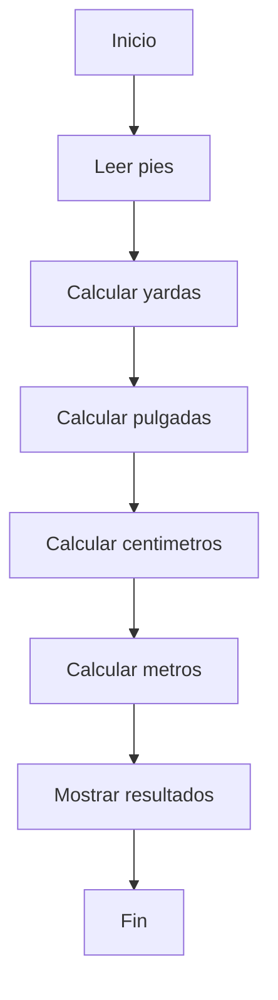

# Universidad Nacional De Loja 
## Portafolio Digital de Aprendizaje – Teoría de la Programación.
- | **Estudiante** | Jose Camilo Merino Morocho |
- | **Carrera** | Ingenieria en Computacion |
- | **Asignatura** | Teoria De La Programacion |
- | **Ciclo** | Primero |
- | **Período Académico** | 2026 |
- | **Docente** | Ing. Lissette Lopez |

# 🚀 Unidad 1: Fundamentos de Programación
------------------------------------------------------------------------------
### 📖 Contenidos

- **Algoritmo** → Es Conjunto ordenado de pasos o instrucciones que permiten resolver un problema o realizar una tarea específica.
- **Pseudocódigo** → Es una Forma de representar un algoritmo usando un lenguaje intermedio entre el lenguaje natural y el de programación, sin reglas estrictas de sintaxis.
- **Diagrama de flujo** → Representación gráfica de un algoritmo mediante formas gemetricas como óvalos, rectángulos, rombos, flechas que muestran el flujo de ejecución. 
- **Prueba de escritorio** → Es una Técnica para verificar un algoritmo paso a paso, simulando su ejecución manualmente con datos de prueba para comprobar su funcionamiento.
- **Lenguajes de programación** → Conjunto de reglas y símbolos que permiten escribir instrucciones que una computadora puede entender y ejecutar como ej: C, Python, Java.

### 🧩 Programación por bloques

Es una Forma de programar usando bloques visuales que se encajan entre sí como piezas o rompecabezas, facilitando el aprendizaje sin necesidad de escribir código como por ejemplo Scratch

-------------------------------------------------------------------------------

## 🛠️ Ejercicio con estructura secuencial: Conversión de Medidas

### 📌 Planteamiento del problema
Escribir un programa para convertir una medida dada en pies a sus equivalentes en: a) yardas; b) pulgadas; c) centímetros; y d) metro. (1 pie: 12 pulgadas, 1 yarda= 3 pies, 1 pulgada= 2.54 cm, 1 metro= 100 cm). Leer el número de pies e imprimir el número de yardas, pies, pulgadas, centímetros y metros.


### 🔍 Análisis del problema

ENTRADA:
- pies

PROCESO:
- yardas = pies / 3
- pulgadas = pies * 12
- centimetros = pulgadas * 2.54
- metros = centimetros / 100

SALIDA:
- Conversión a todas las unidades

### ✍️ Diseño Del Algoritmo

#### Psudocodigo
 Inicio
   1. Leer pies
   2. yardas = pies / 3
   3. pulgadas = pies * 12
   4. centimetros = pulgadas * 2.54
   5. metros = centimetros / 100
   6. Escribir resultados
   
Fin

#### Diagrama de Flujo


### Codificación (código fuente): Desarrollado en C
```c
#include <stdio.h>

int main(){
    float pies, yardas, pulgadas, centimetros, metros;

    printf("Ingrese su medida en pies: ");
    scanf("%f", &pies);

    yardas = pies / 3;
    pulgadas = pies * 12;
    centimetros = pulgadas * 2.54;
    metros = centimetros / 100;

    printf("La medida en pies es: %.2f\n", pies);
    printf("Su medida en yardas es: %.2f\n", yardas);
    printf("Su medida en pulgadas es: %.2f\n", pulgadas);
    printf("Su medida en centimetros es: %.2f\n", centimetros);
    printf("Su medida en metros es: %.2f\n", metros);

    return 0;
}
```
### ✅ Validación (Prueba de escritorio)
| 👣 pies | 📏 yardas | 📐 pulgadas | 📊 cm  | 📏 m |
| ------- | --------- | ----------- | ------ | ---- |
| 3       | 1         | 36          | 91.44  | 0.91 |
| 6       | 2         | 72          | 182.88 | 1.82 |

-------------------------------------------------------------------------------
## ⚠️ Principales dificultades y reflexión crítica en la aplicación de los contenidos.
Algunas dificultades que se pueden presentar podrian ser: 
- Comprender correctamente la lógica del problema antes de programar.
- Traducir correctamente el algoritmo a pseudocódigo.
- Errores de sintaxis en el código AL Momento de programar.
- Falta de práctica en pruebas de escritorio.

### 💭 Reflexión crítica
El desarrollo de algoritmos es un proceso iportante para la programación, ya que permite organizar ideas de forma lógica antes de programar ademas el uso de herramientas como pseudocódigo y diagramas de flujo facilita la comprensión del problema. Sin embargo, es necesario practicar constantemente para mejorar la capacidad de análisis y reducir errores en la implementación.

